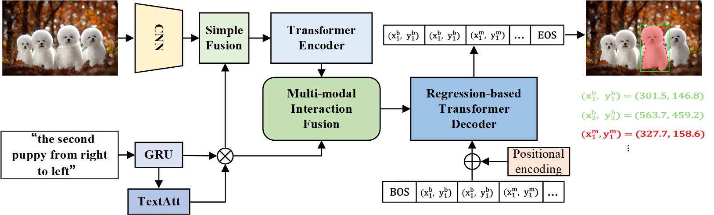

# MMI-VG

  

This is the overview architecture of "Improving Visual Grounding with Multi-modal Interaction and 
Auto-regressive Vertex Generation", which simplifies and unifies the modelling for visual grounding tasks under a novel point prediction paradigm. 

<!-- To this end, different grounding tasks can be tackled in one network with the simple cross-entropy loss. We surpass or maintain on par with state-of-the-arts, and also outperform a set of larget-scale pre-trained models with much less expenditure, suggesting a simple and universal approach is indeed feasible. -->


## Installation

### Prerequisites

```
pip install -r requirements.txt
wget https://github.com/explosion/spacy-models/releases/download/en_vectors_web_lg-2.1.0/en_vectors_web_lg-2.1.0.tar.gz -O en_vectors_web_lg-2.1.0.tar.gz
pip install en_vectors_web_lg-2.1.0.tar.gz
```
Then install package in editable mode:
```
pip install -e .
```

### Data Preparation

1. Download our [preprocessed json files](https://drive.google.com/drive/folders/1IXnSieVr5CHF2pVJpj0DlwC6R3SbfolU?usp=sharing) including the merged dataset for pre-training, and [DarkNet-53 model weights](https://drive.google.com/drive/folders/1W8y_WS-8cnuU0LnF8e1v8ZowZvpEaolk?usp=sharing) trained on MS-COCO object detection task.
2. Download the train2014 images from [Joseph Redmon's mscoco mirror](https://pjreddie.com/projects/coco-mirror/), original [Flickr30K images](http://shannon.cs.illinois.edu/DenotationGraph/), [ReferItGame images](https://drive.google.com/file/d/1R6Tm7tQTHCil6A_eOhjudK3rgaBxkD2t/view?usp=sharing), and [Visual Genome images](http://visualgenome.org/api/v0/api_home.html).

The project structure should look like the following:

```
| -- MMI-VG
     | -- data
        | -- annotations
            | -- flickr30k
                | -- instances.json
                | -- ix_to_token.pkl
                | -- token_to_ix.pkl
                | -- word_emb.npz
            | -- referitgame-berkeley
            | -- refcoco-unc
            | -- refcocoplus-unc
            | -- refcocog-umd
            | -- refcocog-google
            | -- mixed
        | -- weights
            | -- darknet.weights
            | -- yolov3.weights
        | -- images
            | -- mscoco
                | -- train2014
                    | -- COCO_train2014_000000000072.jpg
                    | -- ...
            | -- saiaprtc12
                | -- 25.jpg
                | -- ...
            | -- flickr30k
                | -- 36979.jpg
                | -- ...
            | -- visual-genome
                | -- 2412112.jpg
                | -- ...
     | -- configs
     | -- seqtr
     | -- tools
     | -- teaser
```
Note that the darknet.weights excludes val/test images of RefCOCO/+/g datasets while yolov3.weights does not.

## Training

### Phrase Localization and Referring Expression Comprehension

We train our model to perform grouning at bounding box level on a single 3090Ti GPU with 24 GB memory. The following script performs the training:
```
python tools/train.py configs/seqtr/detection/seqtr_det_[DATASET_NAME].py --cfg-options ema=True
```
[DATASET_NAME] is one of "flickr30k", "referitgame-berkeley", "refcoco-unc", "refcocoplus-unc", "refcocog-umd", and "refcocog-google".

### Referring Expression Segmentation

To train our model to generate the target sequence of ground-truth mask, which is then assembled into the predicted mask by connecting the points, run the following script:

```
python tools/train.py configs/seqtr/segmentation/seqtr_mask_[DATASET_NAME].py --cfg-options ema=True
```

For RefCOCO/+ and RefCOCOg, we uniformly sample 12 points on the mask contour.
## Evaluation

```
python tools/test.py [PATH_TO_CONFIG_FILE] --load-from [PATH_TO_CHECKPOINT_FILE] --cfg-options ema=True
```

The script will evaluate both the performance of the model trained with and without EMA. 

## Acknowledgement

Our code is built upon the open-sourced [mmcv](https://github.com/open-mmlab/mmcv), [mmdetection](https://github.com/open-mmlab/mmdetection) and [detectron2](https://github.com/facebookresearch/detectron2) libraries. Our project is based on [SeqTR](https://github.com/seanzhuh/SeqTR) .
